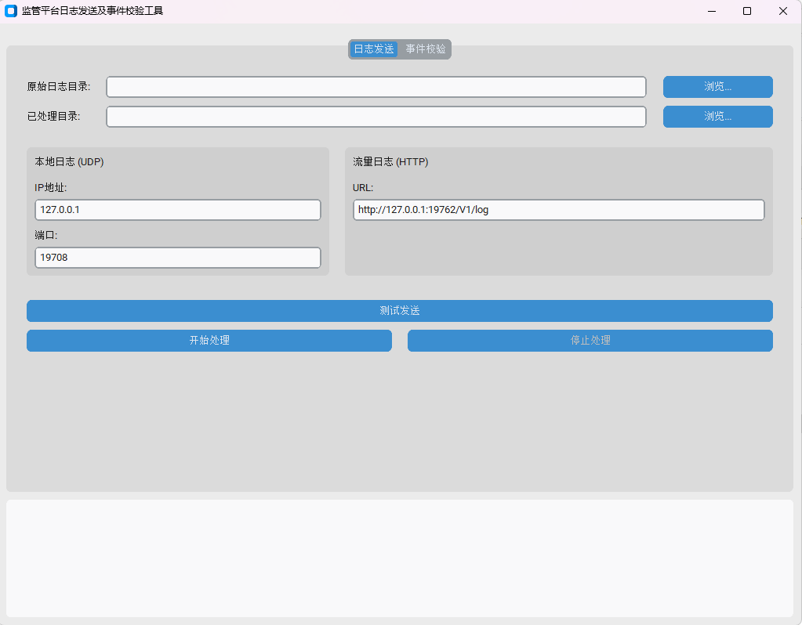
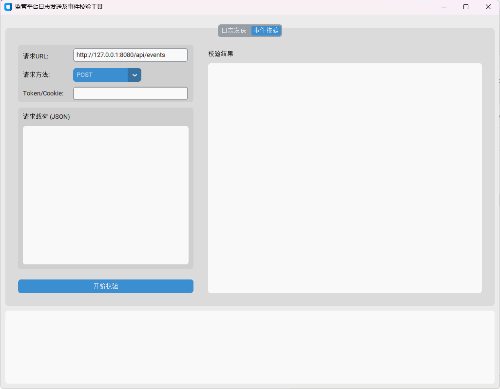
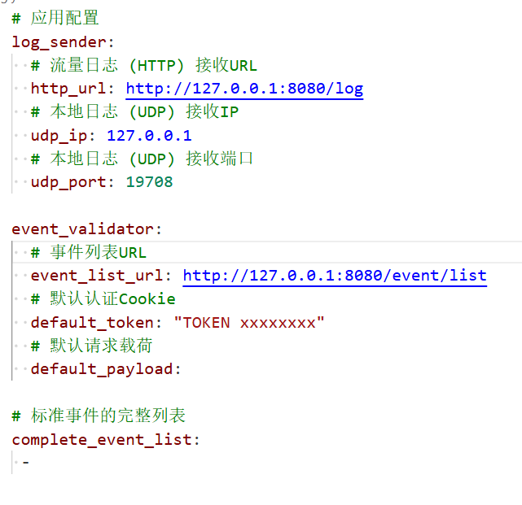

# 监管平台日志发送与事件校验工具 🛠️

一款桌面应用，帮助你轻松完成**日志持续发送**和**事件完整性校验**。
适合运维、测试和开发人员快速验证日志传输与事件完整性。

---

## 功能亮点 ✨

* **日志发送** 📤

  * 监控指定目录下的日志文件。
  * 通过 **UDP** 和 **HTTP** 两种方式发送到服务器。
  * 自动将已发送日志移动到“已处理目录”。
  * 支持快速测试发送，验证服务器连通性。

* **事件校验** ✅

  * 向指定API获取事件列表。
  * 与配置的“标准事件全集”比对，找出缺失事件。
  * 显示统计信息和缺失事件列表，支持GET/POST请求及Token/Cookie认证。

* **实时日志区域** 📜
  所有操作状态、成功信息和错误提示都会实时显示，方便调试。

---

## 快速上手 🚀

1. **安装**

   * 下载最新版桌面程序（支持 Windows/macOS/Linux）。
   * 确保本地网络可访问目标服务器/API。

2. **配置**

   * 默认配置文件位于项目根目录 `config.yml`：

     ```yaml
     log_sender:
       http_url: "http://example.com/log"
       udp_ip: "127.0.0.1"
       udp_port: 9000

     event_validator:
       event_list_url: "http://example.com/api/events"
       default_token: "HKTOKEN ..."
       default_payload: {}

     complete_event_list:
       - EVENT_A
       - EVENT_B
       - EVENT_C
     ```
   * 根据实际需求修改日志服务器和标准事件列表。

3. **使用**

   * 打开应用，切换到 **日志发送** 或 **事件校验** 选项卡。
   * 配置目录或API参数。
   * 点击 **开始处理** / **开始校验** 即可。

---

## 示例截图 📷

**日志发送界面**



**事件校验界面**



**全局配置示意**



---

## 开发 & 贡献 🤝

* 欢迎提出问题、改进建议或提交PR。
* 请保持代码风格统一，必要时更新 `config.yml` 示例。

